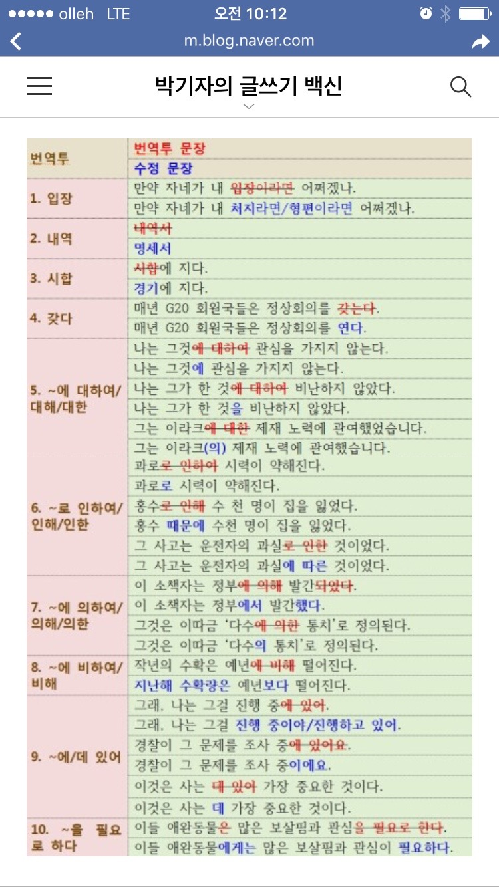

# 06/12 번역 리뷰

R팀 (Ryan) 멘토 김주원(appkr)

## 1. 느낌

-   **몇 군데 어색한 부분 빼고 이해하는데 큰 문제가 없었습니다.**
-   **술술~ 잘 읽힙니다.**

## 2. 리뷰한 내용은

여기에 있습니다. `HTML` -> `Markdown` -> `MS Word` 순으로 변환(transpile)해서 사용했습니다.

-   [Chapter 1:From zero to deploy -> `./beginning.pdf`](beginning.pdf)
-   [Chapter 2:A toy app -> `./toy_app.pdf`](toy_app.pdf)

내용을 전부 발표하려는 것이 아니라, 다른 팀들도 참고할 수 있게 번역에 대한 일반적인 내용을 간단히 공유해 보려 합니다.

> "꼭 이렇게 해야 한다"라고 오해하지 말아 주세요!

## 3. 기술서의 본질 (중요도 순)

1.  정확성

    틀린 내용, 추측, 논리 비약을 포함해서는 안된다.

2.  가독성

    한번에 이해되어야 한다.

3.  완결성

    나는 알지만, 독자는 모를 수 있다. 독자의 눈 높이에서~

## 4. 사전

기술서는 외래어가 많습니다. 외래어를 통일해서 사용하는 것이 중요합니다. 저술이든 번역이든 가장 먼저 해야 하는 중요한 과정이죠(마치 `$ git init`처럼요). 특히, 공동 번역할 때 용어집은 그 빛을 발합니다.

Ruby 및 Rails에서만 쓰는 용어는 커뮤니티 차원에서 정리해 두는 것도 좋을 것 같습니다.

> [다른 커뮤니티의 언어 사전](http://www.modernpug.org/wiki/php-%EC%82%AC%EC%A0%84)

외래어로 된 기술 용어는 [마이크로소프트 언어 포탈](https://www.microsoft.com/language/ko-kr/Search.aspx)과 일반 외래어는 [국립국어원 표준 외래어 표기법](http://www.korean.go.kr/front/foreignSpell/foreignSpellList.do)을 참고합니다. 예) database -> 데이터베이스

## 5. 글 쓰기 주의 사항 (순서 없음)

-   문단 나누기

-   불확실한 글

    ```
    ~ 라고 생각한다.
    ~ 할 것이다.
    ```

-   불필요한 술어

    ```
    이루어지는 것을 확인할 수 있다. -> 이루어진다.
    되는 것을 확인할 수 있다. -> 된다.
    테스트를 진행해 보도록 한다. -> 테스트해보자.
    실행되는 것을 확인할 수 있다. -> 실행한다.
    ```

-   조사 '은', '는'

-   저술이라면 원본 그림 반드시 유지

-   활자 매체라면 URL은 짧은 URL로 바꾸어서

-   외래어는 최대한 한글로, 필요하면 병기. 사람 이름도 한글로.

    ```
    Android에서 App을 설치하기 위해서는 google play에 접속한 뒤 검색하여 download 받는다.
    ```

-   콘솔 및 코드는 텍스트로

-   맞춤법 검사는 MS Word가 가장 좋습니다.

## 6. 번역투 피하기



가장 흔한 번역투는 수동태와 사역 동사입니다. 다음을 더 참고해 보세요.

-   [한빛미디어 "어서와! 번역은 처음이지" -> `./hanbit_article.pdf`](hanbit_article.pdf)
-   [클라우드북스 "집필 유의사항" -> `./cloud_books.pdf`](cloud_books.pdf)
