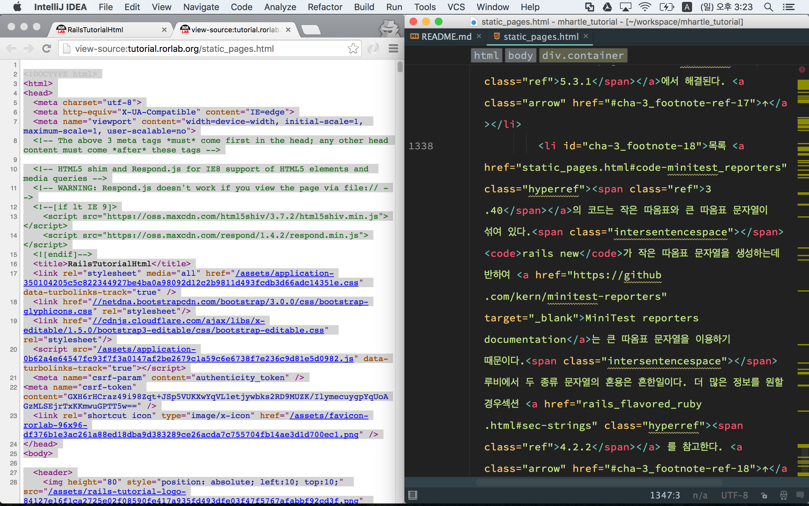
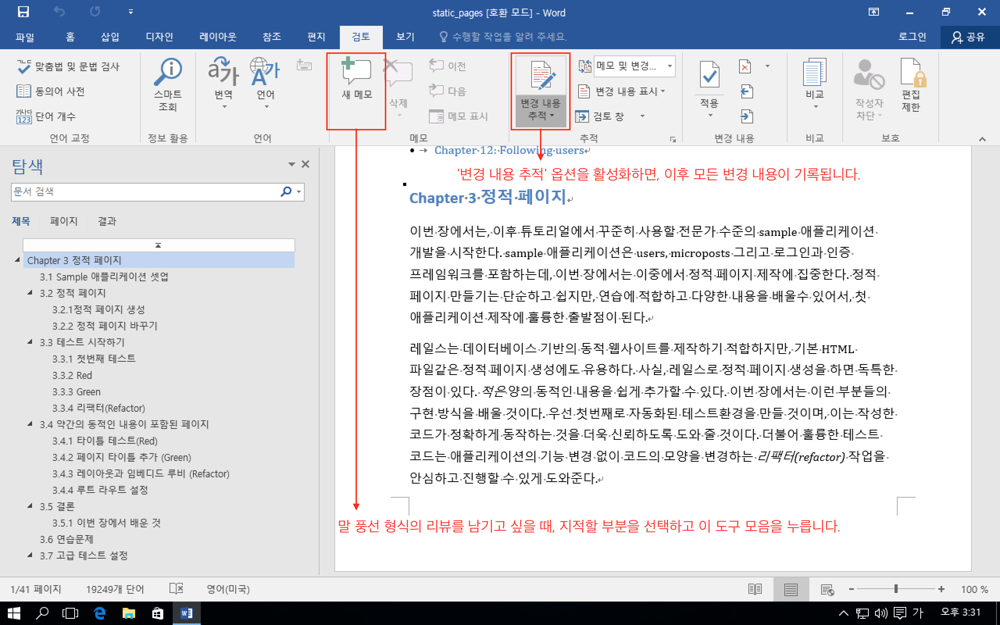

# AGIAN2011 Workshop - 팀 저장소

[AGIAN2011 Workshop](http://rorlab.org/schedules/1)에 참여하는 Ryan팀의 워크 플로우, 번역 리뷰 결과, 팀 회의록 등을 공유하기 위한 저장소입니다.

## 대시 보드

### 필독

-   [워크숍 없는 주 목요일 10시 화상 회의(클릭하면 회의 시작)](https://meet.jit.si/appkr)
-   06/12 [회의록](0612/readme.md)
-   06/16 [회의록](0616/readme.md)
-   06/26 [회의록](0626/readme.md)

### 발표 순서

일시|번역 리뷰 발표|팀 프로젝트 발표
---|---|---
06/12|(1장~2장) [appkr](0612/appkr.md), [drunkencoding](0612/drunkencoding.md)|[appkr](0612/forum_planning.pdf)
06/26|(3장~4장) yihoyoung, jaeryong|appkr
07/10|(5장~6장) drunkencoding, moka|미정
07/24|(7장~8장) yihoyoung, jaeryong|미정
08/07|(9장~10장) drunkencoding, moka|미정
08/21|(11장~12장) yihoyoung, jaeryong|미정

<small>\* 몇 번 더 하고, 덜 할 수 있습니다. 역량이나 시간적인 여유 봐서 업무량을 조율할테니 이해해 주세요.</small>

### 팀 디렉터리

[권한 없는 사용자는 접근할 수 없습니다.](https://docs.google.com/spreadsheets/d/1Yp_ifpO9leaGFZwGMARUQWAp9hZow-R99jhj_cMX2as)

## 파일 추가 워크 플로우

-   저장소를 클론합니다.

    ```sh
    $ git clone git@github.com:appkr/team-ryan.git

    - OR -

    $ git clone https://github.com/appkr/team-ryan.git
    ```

-   YYmm으로 된 작업 디렉터리 아래에 자신의 닉네임으로 발표 자료를 추가합니다.

    ```sh
    team-ryan
    ├── 0612
    │   ├── _ignore             # 리뷰를 위한 로컬 사본 등 (`.gitignore`에 등록됨)
    │   ├── appkr.md            # appkr 리뷰 자료
    │   ├── drunkencoding.ext   # drunkencoding 리뷰 자료
    │   └── readme.md           # 온/오프라인 회의록
    ├── YYmm
    ├── ...
    ├── .gitignore
    └── README.md               # 이 파일
    ```

-   커밋하고 푸쉬합니다. 늦어도 모임 전날까지는 푸쉬해 주세요.

    ```sh
    $ git add .
    $ git commit -m '0612 appkr'
    $ git push
    ```

> **주의 사항**
>
> 리뷰를 위해 로컬에 받은 튜토리얼 번역본은 아직 비공개 상태이므로, 이 저장소를 통해 공개되지 않도록 주의합니다(`.gitignore` 이용).

## [선택 사항] MS 워드로 번역 리뷰를 하기 위한 워크 플로우

### 1단계: 툴 벨트 설치

`pandoc`이란 CLI 바이너리가 필요합니다. OS X에 설치하기 위해서 [Homebrew](http://brew.sh/)가 필요합니다.

```sh
# 로컬 컴퓨터에 Homebrew가 없다면
$ /usr/bin/ruby -e "$(curl -fsSL https://raw.githubusercontent.com/Homebrew/install/master/install)"
$ brew --version

# pandoc 바이너리 설치
$ brew install pandoc
$ pandoc --version
```

### 2단계: HTML 파일 긁어 오기

[http://tutorial.rorlab.org/](http://tutorial.rorlab.org/)에서 리뷰할 챕터를 열고 '웹 페이지 소스 보기'로 소스를 복사하고 확장자를 `.html`로 복사한 내용을 붙여 넣고 저장합니다(인증이 걸려 있어서, `wget`등으로 자동으로 받을 수 없으니 수동으로 받으세요).

```sh
$ ls -al
# -rw-r--r--   1 appkr  staff  186546  6 12 15:23 static_pages.html
```



### 3단계: 변경하기

```sh
$ pandoc --smart --output=static_pages.docx static_pages.html
# 이미지 링크가 깨졌다는 에러 메시지는 무시해도 됨.
```

### 4단계: 리뷰

MS 워드의 `검토` > `변경 내용 추적` 기능을 활성화하면, 이후 해당 문서에 발생하는 모든 변경을 기록할 수 있습니다. 리뷰한 문서는 워드의 `다른 이름으로 저장` 또는 다시 `pandoc` 명령을 이용해서 `.pdf`등 다양한 형식으로 내보내기 할 수 있습니다.


